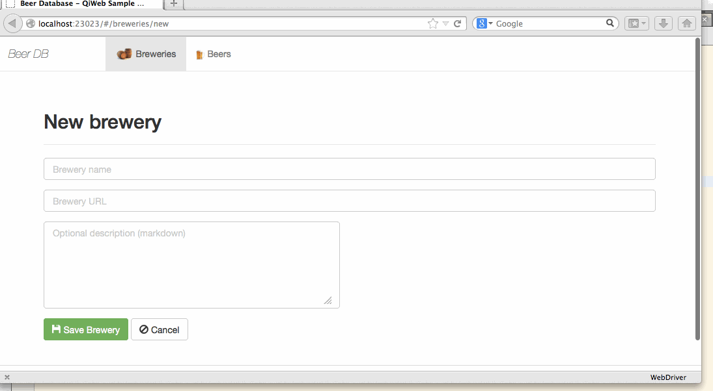

# Beer Database - QiWeb Sample Application

This sample is backed by an [EclipseLink][1] [JPA 2][2] store for breweries
and beers. It expose a [JSON][3] api consumed by an [AngularJS][4] front-end.

In development and test modes, the JPA 2 store is an in-memory [H2][5]
database. A production configuration that use [PostgreSQL][6] is provided.

Database schema migration is done using [Liquibase][7]. Initial data and test
fixtures are loaded using [Fixy][8].

Acceptance tests against the JSON api are implemented using [rest-assured][9].
A [JMeter][10] scenario to load-test the JSON api is provided.

Acceptance tests against the AngularJS front-end are implemented using
[FluentLenium][11].

The application is deployed live at [qiweb-beerdb.herokuapp.com](http://qiweb-beerdb.herokuapp.com).

[1]: http://www.eclipse.org/eclipselink/
[2]: http://jcp.org/aboutJava/communityprocess/final/jsr317/
[3]: http://www.ecma-international.org/publications/standards/Ecma-404.htm
[4]: http://angularjs.org/
[5]: http://www.h2database.com/
[6]: http://www.postgresql.org/
[7]: http://www.liquibase.org/
[8]: https://github.com/sberan/Fixy
[9]: https://code.google.com/p/rest-assured/
[10]: https://jmeter.apache.org/
[11]: http://fluentlenium.org/
